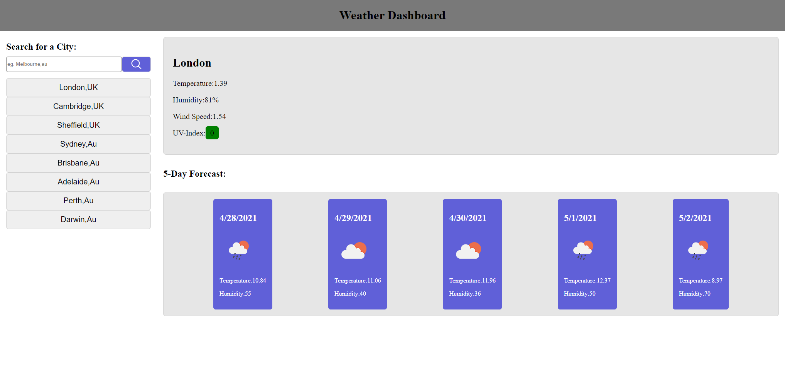

# Weather Planner

This app will help you plan you see the weather of different locations around the world.
There are pre selected options and there is also a search bar for custom locations.

## Comments

I used the openweather geocoding and onecall api to retrieve the weather info objects.

## Screenshot

## Live Site

[Here](https://lewy192.github.io/weather-planner/) you will find a live deployed version thanks to GitHub Pages.

## Acknowledgements

[w3schools](https://www.w3schools.com/js/default.asp)
